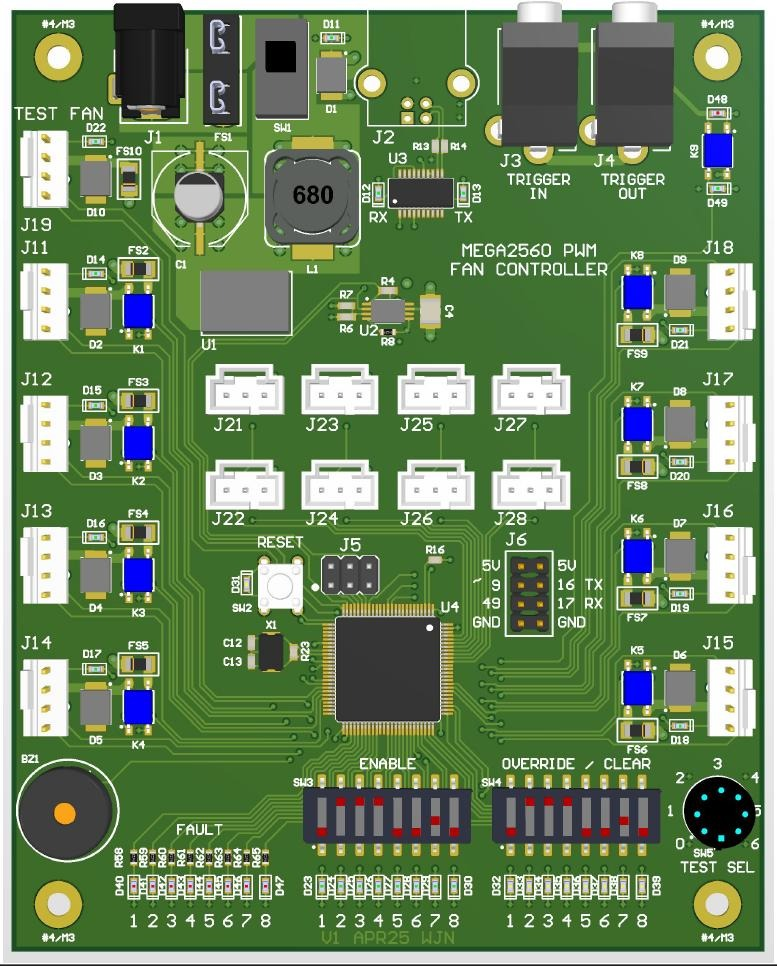

<!-- Improved compatibility of back to top link: See: https://github.com/othneildrew/Best-README-Template/pull/73 -->

<!--
*** Hey there, welcome to my README File. Here's a couple helpful resources for writing up files like this:
*** - VS Code is super hepful for previewing files like this (CTRL + Shift + V).
*** - Alternatively, Notepad++ has a few plugins (e.g. MarkdownViewer++) that can preview files. 
*** - GitHub documentation (good for the basics): https://docs.github.com/en/get-started/writing-on-github/getting-started-with-writing-and-formatting-on-github/basic-writing-and-formatting-syntax
*** - Best-README-Template (lets you do sophisticated things): https://github.com/othneildrew/Best-README-template/blob/main/README.md
-->

<!-- Logo and Title Section -->
 

  
  <h3 align="center"><strong>Mega2560 Fan Controller</strong></h3>
  
  

    Wil Neeley
	 
	2025-05-12
  

<!-- TABLE OF CONTENTS -->

  
Table of Contents

  <ol>
    <li><a href="#about-the-repository">About The Repository</a>
      <ul>
        <li><a href="#built-with">Built With</a></li>
      </ul>
    </li>
    <li><a href="#the-hardware">The Hardware</a></li>
    <li><a href="#the-firmware">The Firmware</a></li>
    <li><a href="#usage">Usage</a></li>
    <li><a href="#roadmap">Roadmap</a></li>
    <li><a href="#contributing">Contributing</a></li>
    <li><a href="#license">License</a></li>
    <li><a href="#contact">Contact</a></li>
  </ol>

## About The Repository

This GitHub repository contains both hardware and firmware information for my custom PC fan controller board based on the Arduino Mega2560. There is (or at least will be) enough information in this repository for you to order parts, order your own bare circuit board, assemble it yourself, flash it with an Arduino bootloader, and program it to your heart's content!

(<a href="#readme-top">back to top</a>)

### Built With

The design and layout of my board was done using CircuitMaker. 

The firmware for my board was done using the Arduino IDE.

## The Hardware

For more information on the board and how to make one for yourself, please see the [Getting Started](./hw/HW_GETTING_STARTED.md) file in the ***hw*** folder.

(<a href="#readme-top">back to top</a>)

## The Firmware

For more information on how to program your freshly made board, please see the [Getting Started](./fw/FW_GETTING_STARTED.md) file in the ***fw*** folder.

(<a href="#readme-top">back to top</a>)

