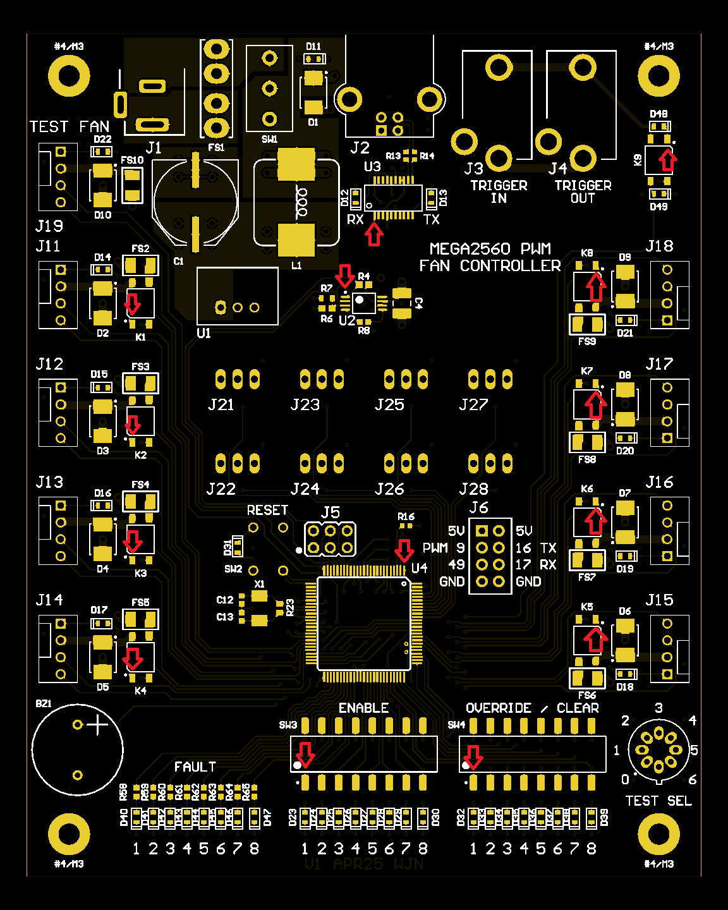
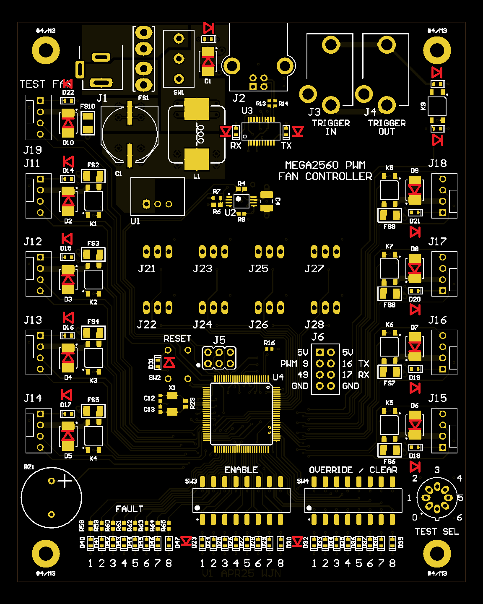

<!-- Improved compatibility of back to top link: See: https://github.com/othneildrew/Best-README-Template/pull/73 -->

<!--
*** Hey there, welcome to my README File. Here's a couple helpful resources for writing up files like this:
*** - VS Code is super hepful for previewing files like this (CTRL + Shift + V).
*** - Alternatively, Notepad++ has a few plugins (e.g. MarkdownViewer++) that can preview files. 
*** - GitHub documentation (good for the basics): https://docs.github.com/en/get-started/writing-on-github/getting-started-with-writing-and-formatting-on-github/basic-writing-and-formatting-syntax
*** - Best-README-Template (lets you do sophisticated things): https://github.com/othneildrew/Best-README-template/blob/main/README.md
-->

<!-- Logo and Title Section -->
 

  <!--  -->
  <h3 align="center"><strong>
    Mega2560 Fan Controller      
    Post-Assembly Inspection
  </strong></h3>
  
  

    Wil Neeley
     
    2025-05-18
  

<!-- TABLE OF CONTENTS -->

  
Table of Contents

  <ol>
    <li><a href="#overview">Overview</a>
      <ul>
        <li><a href="#recommended-equipment">Recommended Equipment</a></li>
      </ul>
    </li>
    <li><a href="#workmanship-visual-inspection">Workmanship Visual Inspection</a>
      <ul>
        <li><a href="#ic-orientation">IC Orientation</a></li>
        <li><a href="#ic-solder-joints">IC Solder Joints</a></li>
        <li><a href="#surface-mount-solder-joints">Surface Mount Solder Joints</a></li>
        <li><a href="#through-hole-solder-joints">Through Hole Solder Joints</a></li>
      </ul>
    </li>
    <li><a href="#electrical-tests">Electrical Tests</a>
      <ul>
        <li><a href="#power-rail-resistances">Power Rail Resistances</a></li>
        <li><a href="#first-time-power-on">First Time Power On</a></li>
      </ul>
    </li>
    <li><a href="#next-steps">Next Steps</a></li>
  </ol>

## Overview

So, you've assembled your board, and now you want to power it on. Before you do so, however, I encourage you to run through the following inspection steps. Otherwise, you may find your freshly assembled board letting out the magic smoke!

(<a href="#readme-top">back to top</a>)

### Recommended Equipment

Some of these items can be tweaked based on what you have, but here's what I recommend:

* A good light source
* A magnifying glass
* A benchtop power supply with the following capabilities:
    * High enough voltage output (in my case, 12V)
    * High enough current output (in my case, 3A)
    * Real time voltage and current readings
    * Adjustable output current limiting (lets you set a safe limit in case something's wired incorrectly)
* A multimeter with the following capabilities:
    * Resistance measuring
    * Continuity testing
    * Diode testing
    * Current measurement, up to 3A (if your power supply lacks current measurement)
        * MAKE SURE YOUR MULTIMETER HAS A WORKING FUSE FIRST.
* A USB-B cable (one that feeds the chunky USB connector on the board)
* A matching 5V USB power brick
    * Can use a computer USB port instead, but if your board has a problem, you could permanently damage the port. DO SO AT YOUR OWN RISK!

(<a href="#readme-top">back to top</a>)

## Workmanship Visual Inspection

If you want to learn about industry-standard circuit board assembly inspection methods and requirements, look into [IPC-A-610: Acceptability of Electronic Assemblies](https://shop.ipc.org/ipc-a-610). For a quick overview of its contents, [look here](https://www.ipc.org/TOC/IPC-A-610G.pdf). What I'll be covering here is fairly informal, and is more geared towards checking for common mistakes.

(<a href="#readme-top">back to top</a>)

### IC Orientation

As a first step, verify you installed your integrated circuits (ICs) in the correct orientation. If a component is installed backwards, you could easily apply power backwards or otherwise in a way the chip isn't designed to receive power, and it will be permanently damaged. 

The V1 board was not great about marking Pin 1 in an obvious location, so it's easy to get wrong. On one of my boards, I even managed to install U4 (the microcontroller) in the wrong orientation TWICE IN A ROW, though I'm partially blaming that on bad lighting. Use the picture below as a reference for your Pin 1 indicators. 

(<a href="#readme-top">back to top</a>)

### IC Solder Joints 

Integrated circuits, especially U3 (FTDI chip) and U4 (microcontroller), have a large number of small, close-together pins. It's easy to mess up even one pin, which can lead to unpredictable behavior and/or component damage. Take some time with your magnifying glass (and good light) and inspect all of the pins. 

Watch for the following problems:

* Incomplete solder joints or unsoldered pins
* Solder bridges between pins
* Misaligned pins (e.g. one pin spread across two pads, or even the whole chip shifted over by one pin on accident)

If you run into any of the above problems, you'll need to fix them with your soldering iron,  healthy amount of flux, and maybe some extra solder and/or solder wick. 

(<a href="#readme-top">back to top</a>)

### Surface Mount Solder Joints

While U3 and U4 are the trickiest components and your highest probability spot for mistakes, don't neglect checking your other surface mount components. Inspect your resistors, capacitors, LEDs, diodes, and fuses to ensure both sides have adequate solder. 

If you weren't double-checking your diode and/or LED orientations while installing them, verifying them now can be tricky, as the built-in protective diodes from connected components can confound your testing.  

(<a href="#readme-top">back to top</a>)

### Through-Hole Solder Joints

Double-check your through-hole solder joints. Look for a shape like a Hershey's Kisses candy. If they look more like the picture below, see [Adafruit's Guide to Excellent Soldering: Common Soldering Problems](https://learn.adafruit.com/adafruit-guide-excellent-soldering/common-problems). 

(<a href="#readme-top">back to top</a>)

## Electrical Tests

Now that the visual inspection's been taken care of, it's time to do some electrical tests. The first test involves testing your power rails for short circuits (or open circuits), while the second test involves safely applying power for the first time. 

(<a href="#readme-top">back to top</a>)

### Power Rail Resistances

Before applying power, one of the simplest tests you can do involves measuring the resistance of your board's power rails. If the resistance is high, that's a good sign you don't have any electrical shorts. If the resistance is low or near zero, that's an indication you have an electrical short somewhere, which can be caused by any number of mistakes (solder bridges, incorrectly installed components, etc.).

Before performing your tests, make sure the following switches are in the following positions, or your resistances may be skewed: 
* SW1: down (i.e. off)
* SW3: all down (i.e. off)
* SW4: all down (i.e. off)

Below is a list of the power rails worth checking out, the best places to probe, and an approximate resistance value to expect. NOTE: For values labeled "High", the exact value you measure can vary between multimeters and even board to board. The important thing is verifying it's not low (e.g. less than 1 kΩ).

| Power Rail | Positive Test Point | Negative Test Point | Resistance (approx.) |
| -- | -- | -- | -- |
| Input | Fuse (FS1) | Mounting Hole (GND) | High (> 1 MΩ) |
| +12V | L1 (either side) | Mounting Hole (GND) | High (> 100 kΩ ) |
| +5V | J21, Pin 1 | Mounting Hole (GND) | 7.3 kΩ |
| 5V_USB | L2 (either side) | Mounting Hole (GND) | 10 kΩ (R2) |
| VCC | J5, Pin 2 | Mounting Hole (GND) | High (> 100 kΩ) |
| 3V3OUT | C8, Pin 1 | C8, Pin 2 | High (> 100 kΩ) |

As a secondary test, you can assess the isolation between the different power rails (e.g. "+12V" and "+5V") to make sure they aren't shorting together. 

NOTE: Performing the power rail resistance measurements saved me on one of my assembled boards. While assessing the "5V_USB" rail, the resistance to ground came up 0.4Ω (the resistance of just my probes), which was clear evidence the power rail was shorted to ground. Had I applied power via USB, I could have damaged my power source (i.e. my laptop). Consulting the schematic narrowed down my components of interest, and inspecting the board revealed R2 was messily soldered and had bridged. After cleaning it up, the power rail went back to 10 kΩ, indicating the problem was solved!

(<a href="#readme-top">back to top</a>)

### First Time Power On

Now that you know your power rails aren't shorted together, you can try applying power to your board! Here are the steps I recommend:

1. Configure your power supply. 
    * If using a benchtop power supply, here are some recommendations.
        * Set the output voltage to 12V (or, if you've adapted my design to 24V, use 24V instead)
        * Set the output current limit to something low (e.g. 0.1A)
        * If using alligator clips, you can supply power via the following points:
            * Positive: FS1 (the main power fuse)
                * If using the outer-most post, you're defeating the fuse on the V1 board. I'll fix this for V2. 
            * Negative: Mounting hole
    * If using a standard 12V power brick, you can remove the main power fuse (FS1) and insert your multimeter (wired for current measurement mode) in its place to monitor the current. The positive lead should go in the bottom terminal, while the negative lead should go in the top terminal.  
2. Before turning on your benchtop power supply or power brick, make sure SW1 is in the OFF (down) position. 
3. Turn on your power supply. 
    * No LEDs should come on.
    * Your current should be 0A (or <1mA, at least)
4. With the power supply on, flip SW1 to the ON position (up).
    * Your current should read ~0.01A (assuming you have a low resolution benchtop supply)
    * The following LEDs should come on:
        * D11 (Board Power)
        * D22 (Test Fan Power)
5. Using a mounting hole as your reference, measure the voltage at the following points with your multimeter:
    * +12V (FS10, either side): should read the same as your power supply (~12V)
    * +5V (J21, Pin 1): should read close to 5V
    * 5V_USB (L2, either side): should read 0V
    * VCC (J5, Pin 2): should be about the same as +5V (close to 5V)
6. Turn off the board and disconnect your power supply. 
7. Using your USB cable and a USB power brick, power your board through the USB connector (J2). No LEDs should turn on.
8. Using a mounting hole as a reference, measure the voltage at the following points with your multimeter:
    * +5V (J21, Pin 1) should read 0V
    * 5V_USB (L2, either side): should read ~5V (depends on how good your power brick is)
    * VCC (J5, Pin 2): should be about the same as 5V_USB (around 5V)

Assuming all of the above worked, your board has passed its post-assembly inspection!

(<a href="#readme-top">back to top</a>)

## Next Steps

Once you've successfuly powered on your board, it's time to flash the Arduino bootloader and start programming! See [Loading the Arduino Bootloader](./fw_loading_arduino_bootloader.md) for more details. 

(<a href="#readme-top">back to top</a>)
